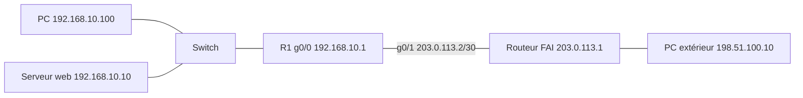

# Lab Cisco : NAT, PAT et ACL

> **Statut : à réaliser.** Ce guide est préparé à partir de la documentation officielle et de mes cours ; **je ne l'ai pas encore rejoué de bout en bout**. Les commandes sont à valider en le faisant, et le journal en bas de page sera complété avec mes résultats réels (captures, erreurs rencontrées, corrections).

## Objectif

Mettre en place, sur un routeur de bordure, trois mécanismes indissociables d'un accès internet d'entreprise :

1. **PAT** (NAT avec surcharge) : tout le réseau local sort avec une seule adresse publique ;
2. **NAT statique** avec redirection de port : rendre un serveur interne joignable de l'extérieur ;
3. **ACL** : filtrer (interdire Telnet) et restreindre l'administration du routeur.

## Prérequis

- Cisco Packet Tracer (routeur 2911).
- Notions : adresses privées et publiques, ports TCP, masque inverse.

## Topologie



Les plages `203.0.113.0/24` et `198.51.100.0/24` sont réservées à la documentation (RFC 5737) : elles servent ici d'« adresses publiques » sans risque.

## Étapes

### 1. Interfaces et route par défaut

Fichier du dépôt : [`configs/R1.txt`](configs/R1.txt)

```text
enable
configure terminal
hostname R1
interface g0/0
 ip address 192.168.10.1 255.255.255.0
 ip nat inside
 no shutdown
interface g0/1
 ip address 203.0.113.2 255.255.255.252
 ip nat outside
 no shutdown
!
ip route 0.0.0.0 0.0.0.0 203.0.113.1
!
! --- PAT : tout le LAN sort avec l'adresse de g0/1
access-list 1 permit 192.168.10.0 0.0.0.255
ip nat inside source list 1 interface g0/1 overload
!
! --- NAT statique : le serveur web est joignable sur le port 8080 de l'adresse publique
ip nat inside source static tcp 192.168.10.10 80 203.0.113.2 8080
!
! --- ACL étendue : interdire Telnet depuis le LAN (sauf la station d'administration vers le routeur), tout le reste passe
ip access-list extended BLOQUE-TELNET
 permit tcp host 192.168.10.100 host 192.168.10.1 eq 23
 deny tcp any any eq 23
 permit ip any any
interface g0/0
 ip access-group BLOQUE-TELNET in
!
! --- ACL standard : seule la station d'administration peut ouvrir une session sur le routeur
access-list 10 permit host 192.168.10.100
enable secret MotDePasseLab1
line vty 0 4
 password TelnetLab1
 login
 access-class 10 in
end
write memory
```

Les mots de passe de cette configuration sont des valeurs de laboratoire. Le routeur du FAI (`203.0.113.1`) et le PC extérieur sont configurés avec des adresses fixes ; le FAI a une route retour vers `203.0.113.0/30` seulement, pas vers `192.168.10.0/24` : c'est justement le NAT qui doit rendre la sortie possible.

### 2. Ordre des ACL

Une ACL se lit **de haut en bas** et s'arrête à la première règle qui correspond ; il y a un `deny any` implicite à la fin. Un `deny` trop général placé avant un `permit` bloque tout. Sur `BLOQUE-TELNET`, la ligne `permit ip any any` est donc indispensable, sinon l'ACL bloque tout le reste. Et l'**ordre** compte : si l'on inversait les deux premières lignes, la station d'administration ne pourrait plus ouvrir de session Telnet sur le routeur, car le `deny` serait lu avant le `permit`. (Telnet n'est utilisé ici que pour l'exercice : en réel, on administre par SSH.)

## Vérifications

```text
! Depuis le PC du LAN : ping 198.51.100.10   (doit répondre grâce au PAT)
show ip nat translations     ! une ligne par flux, adresse interne locale -> globale
show ip nat statistics       ! compteurs et interfaces inside / outside
show access-lists            ! compteurs « (n matches) » qui augmentent avec le trafic
! Depuis le PC extérieur : navigateur vers http://203.0.113.2:8080  (page du serveur interne)
! Depuis le PC du LAN : telnet 198.51.100.10  (doit échouer)
! Depuis 192.168.10.100 : telnet 192.168.10.1  (doit fonctionner : règle permit en tête de l'ACL et access-class)
! Depuis un autre poste du LAN : telnet 192.168.10.1  (doit échouer)
```

## Pièges fréquents

- Oublier `ip nat inside` ou `ip nat outside` sur l'une des interfaces : aucune traduction.
- ACL de NAT trop large ou mal orientée (`list 1` doit désigner les adresses **internes**).
- ACL appliquée dans le mauvais sens (`in` ou `out`) ou sur la mauvaise interface.
- `access-class` (sur les lignes VTY) ne se confond pas avec `access-group` (sur une interface).

## Pour aller plus loin

- Remplacer l'interface de sortie par un **pool** d'adresses publiques et observer la différence avec `overload`.
- Ajouter une ACL nommée qui autorise HTTP/HTTPS mais bloque les ping (ICMP) vers le serveur.
- Journaliser les refus avec le mot-clé `log` et lire les messages avec `show logging`.
- Refaire l'exercice de filtrage avec `nftables` sur Linux : [lab-fail2ban-ssh-durcissement](https://github.com/mehdiseg/lab-fail2ban-ssh-durcissement).

## Références

- [RFC 3022 : Traditional IP Network Address Translator](https://www.rfc-editor.org/rfc/rfc3022)
- [RFC 5737 : Adresses IPv4 réservées à la documentation](https://www.rfc-editor.org/rfc/rfc5737)

## Journal de réalisation

_Lab pas encore réalisé : cette section sera remplie au fur et à mesure._

| Date | Ce que j'ai fait | Résultat | Difficultés et solutions |
|---|---|---|---|
|  |  |  |  |

## Feuille de route

Ce lab fait partie de ma [feuille de route réseau](https://github.com/mehdiseg/roadmap-reseau-bts-sio).
